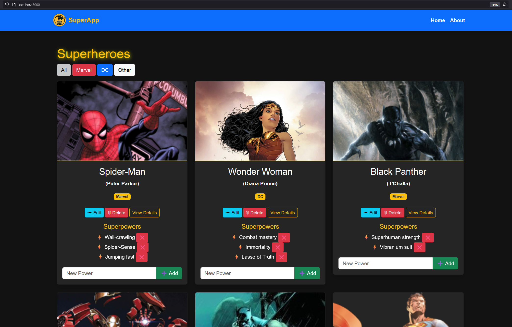

# SuperApp!

A simple app that allows you to Create, Retrieve, Update, and Delete superheroes from a database.

  

## Getting Started  

Before running this project, make sure you have **Python 3** installed and added to your **PATH**.  

1. **Install dependencies**  
   Open your command line and run:  
   ```sh
   pip install -r requirements.txt
   ```
2. **Set up the database**  
   Navigate to the project’s root directory and run:  
   ```sh
   python seed_db.py
   ```
3. **Start the app**  
   Run the following command:  
   ```sh
   python run.py
   ```
4. **Visit the app in your browser**  
   Open [http://localhost:5000](http://localhost:5000) to see the app in action!  

---

## Purpose  

This project is a **fun introduction to web development** using **Python and Flask**. It demonstrates how websites **store and manage data** using a **database (SQLite)**, allowing users to **add, edit, and delete superheroes**.  

Each superhero has a **real name, alias, universe, and an image**, and can have **multiple superpowers**. This teaches an important **database concept** called a **one-to-many relationship**.  

The app also introduces **security and accessibility concepts**, such as:  
- **Form validation** to prevent errors when submitting data  
- **CSRF protection** to prevent unauthorized form submissions  
- **File uploads** with security checks  
- **Web Content Accessibility Guidelines (WCAG)** to make the app **more usable for everyone**  

By working on this project, students get hands-on experience with **backend development, databases, and security**—all essential skills for modern web development.

---

## Walkthrough  

This project was built step by step, with each commit adding new functionality. Below is a breakdown of what each step accomplished. Click through the commit history to see the code for each of these steps: 

1️⃣ **Created basic hello world page**  
   - Started the Flask app with a simple **"Hello, World!"** page.  
   - This introduced **Flask routing** and how a **Python backend serves web pages**.  

2️⃣ **Created two pages and routes (home and about)**  
   - Added `home.html` and `about.html`, showing how **Flask renders templates**.  
   - Introduced the concept of **routes** (`@app.route()`), allowing different URLs to display different pages.  

3️⃣ **Added superhero-themed logo and styling**  
   - Used **Bootstrap** to improve the UI.  
   - Introduced a **navbar with a logo** to make navigation easier.  

4️⃣ **Introduced a SQLite database and setup script**  
   - Added **SQLite as a lightweight database** to store superhero data.  
   - Created a `seed_db.py` script to **populate the database with initial superheroes**.  

5️⃣ **Added `.gitignore` to exclude the database file**  
   - Prevented `superheroes.db` from being tracked in Git to **avoid conflicts**.  
   - Helped keep the repository clean.  

6️⃣ **Added pictures for superheroes**  
   - Each superhero now has an **image stored in the database**.  
   - Users can now visually recognize heroes.  

7️⃣ **Created a form that allows users to add their own superheroes**  
   - Added an **HTML form** where users can submit new superheroes.  
   - Handled **form submissions in Flask** and saved them to the database.  

8️⃣ **Added a secure file upload button to the superhero form and used `flash()` to give feedback**  
   - Allowed users to **upload images** for superheroes.  
   - Used `flash()` to **notify users of successful or failed uploads**.  
   - Prevented **malicious file uploads** by checking file extensions.  

9️⃣ **Added the ability to edit and delete existing superheroes**  
   - Introduced **edit and delete buttons** on superhero cards.  
   - Allowed users to modify or remove heroes from the database.  

🔟 **Added filtering based on superhero universe**  
   - Users can **filter superheroes by Marvel, DC, or Other**.  
   - Implemented this using **Flask query parameters** (`?universe=Marvel`).  

1️⃣1️⃣ **Added collapsible sections to superhero cards for less visual clutter**  
   - Superpowers and actions (edit/delete) are now **hidden by default**.  
   - Clicking "View Details" **reveals the additional info dynamically**.  

1️⃣2️⃣ **Superpowers can now be added and deleted against superheroes**  
   - Introduced a **one-to-many relationship** in the database.  
   - Allowed users to **add superpowers** to each superhero dynamically.  

1️⃣3️⃣ **Added form restrictions and sanitization**  
   - Prevented users from entering **invalid data** (empty names, numbers in names, etc.).  
   - Sanitized user input to **prevent SQL injection and XSS attacks**.  

1️⃣4️⃣ **Prevented duplicate superheroes (by checking real names or image names) and duplicate powers**  
   - Ensured that no two superheroes have the **same name or image filename**.  
   - Prevented users from **adding the same superpower multiple times**.  

1️⃣5️⃣ **Added cascade delete to prevent orphaned records in the `superpowers` table**  
   - When a superhero is deleted, their **superpowers are also deleted**.  
   - This keeps the database **clean and avoids broken data**.  

1️⃣6️⃣ **Hardened the app against CSRF (Cross-Site Request Forgery) attacks**  
   - Integrated **Flask-WTF** for **CSRF token protection**.  
   - Ensured that **all forms require a CSRF token** before submission.  

1️⃣7️⃣ **Implemented a custom 404 page if someone tries to edit a superhero that does not exist**  
   - If a user enters an invalid superhero ID, they see a **custom 404 error page**.  
   - Improves **user experience** and **prevents app crashes**.  

1️⃣8️⃣ **Made changes to improve accessibility and align with WCAG (Web Content Accessibility Guidelines)**  
   - Added **ARIA labels** and **better color contrast**.  
   - Improved **keyboard navigation and screen reader support**.  

1️⃣9️⃣ **Added functional tests using `pytest` to ensure the app behaves correctly**  
   - Wrote **tests for adding, editing, and deleting superheroes**.  
   - Used `pytest` to **automate testing** and ensure that the app works as expected.  

---

## Challenge  

Want to take this project **to the next level**? Try downloading this project and extending its functionality by adding:  

🔹 **Villains** – Add a new database table and page to handle supervillains. Create relationships with the superheroes (e.g. archnemesis).  
🔹 **Pagination** – Break the superhero list into pages so all superheroes don’t load at once.  
🔹 **Image Resizing** – Optimize superhero images to reduce load times.  
🔹 **Logging** – Keep track of user actions and errors in a log file.  
🔹 **SQL Indexing** – Improve database performance when searching for superheroes.  
🔹 **More Tests** – Expand automated testing for better reliability.  
